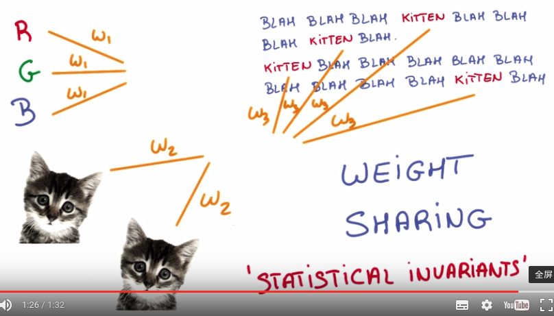
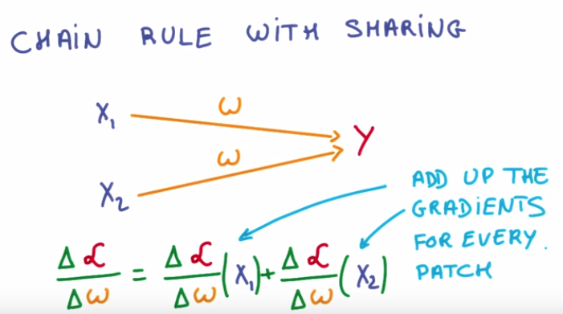
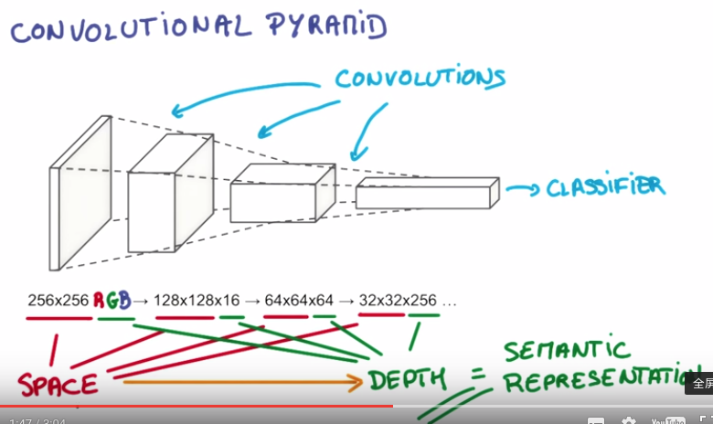
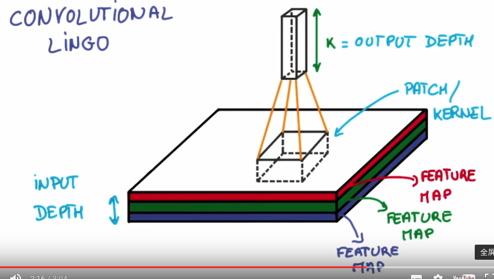
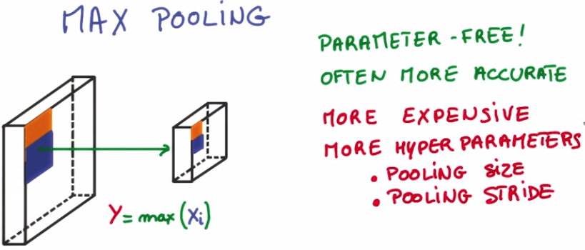
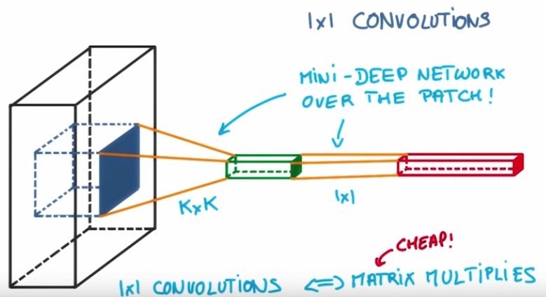
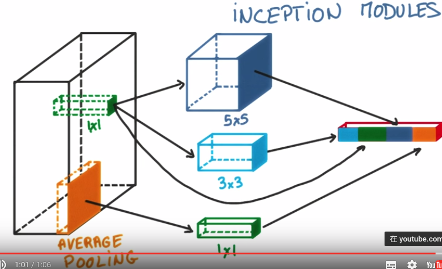

###1. From DNN to CNN
If we alreadly know the structure of data, we can design specific model (such as CNNs for image) which considers the data structure rather then use general model (such as multi-layer perception machines). For images, CNNs can group together adjacent pixels and treating them as a collective, while non-convolutional neural network always ignores this adjacency.

###2. Statistical Invariance by Weights sharing
Statistical invariance is very important for many tasks. Weights sharing is the key to achieve various statistical invariance properties in CNN/RNN or other methods. In a summary, if two inputs contaion the same information for the task, we share weights across them. Specifically, we should train the shared weights jointly and reuse them for these inputs. For different tasks, we may want different statistical invariance properties.
For example: 
1) Pedestrain detection needs detector invariant to colors. Typically, we use `gray=(R+G+B)/3` (or Y channel in YUV) as input instead of RGB. This is indead some kind of weights sharing, i.e. sharing weights across R, G, B. 
2) Image classification needs the classifier invariant to object space positions. CNN use the weights sharing to solve it, i.e. each filter only contains one weight set which is shared across different positions. (E.g. If we want a cat that’s in the top left patch to be classified in the same way as a cat in the bottom right patch, we need the weights and biases corresponding to those patches to be the same, so that they are classified the same way.)
3) Sequential data may need model invariant to the time/order. RNN/Embeding technics achieve this with the idea of weights sharing across time/order.

  

For the chain rule with weights sharing, the math is the same, we just add the derivates of every patch.

  

There’s an additional benefit to sharing our parameters. If we did not reuse the same weights across all patches, we would have to learn new parameters for every single patch and hidden layer neuron pair. Sharing parameters not only helps us with translation invariance, but also gives us a smaller, more scalable model.

###3. CNNs understand
1) Convolutional Pyrimid: Deeper conv layer has lower space dimensions and higher depth dimensions. This corresponds roughly to the sementic complexity of each layer's representation, i.e. deeper layer gives more sementic representation.

  

2) Convolutional  Lingo: Depth, Feature Map, Patch/Kernel, Stride, Padding ("valid" padding/"same" padding).

  

3) Why multiple filters: Having multiple neurons for a given patch ensures that our CNN can learn to capture whatever characteristics the CNN learns are important.

###4. Convolutional layer output shape
Given our input layer has a volume of `W`, our filter has a volume `(height * width * depth)` of `F`, we have a stride of `S`, and a padding of `P`, the following formula gives us the volume of the next layer: `(W−F+2P)/S+1`.

###5. Advanced CNN topics
1) **Pooling** 
Stride can reduce dimension to some extent, but it also removes a lot of information. While pooling can combine the information (still loss some info) as well as reduce dimension. Consequently, the dimenson reduction can help to prevent overfitting. The most common way is max-pooling. In tensorflow, the function is `tf.nn.max_pool()` which performs max pooling with the `ksize` parameter as the size of the filter and the `strides` parameter as the length of the stride. 2x2 filters with a stride of 2x2 are common in practice.

  

Note that the shape of pooling output is `(W−F)/S+1` with out padding `P`.
Recently, pooling layers have fallen out of favor. Some reasons are:
- Recent datasets are so big and complex we're more concerned about underfitting.
- Dropout is a much better regularizer.
- Pooling results in a loss of information. Think about the max pooling operation as an example. We only keep the largest of n numbers, thereby disregarding n-1 numbers completely.

2) **1x1 Convolutions**
For a local patch, traditional conv layer is like a linear trasform, while 1x1 conv layer performs like a local deep model which can make your models deeper and more parameters. Besides, 1x1 conv layer is inexpensive to compute and has the same structure with traditional conv layer.

  

3) **Inceptions**
Choose various operations between two layers. It is interesting that the number of model parameters is still small while the model performs better.

  

