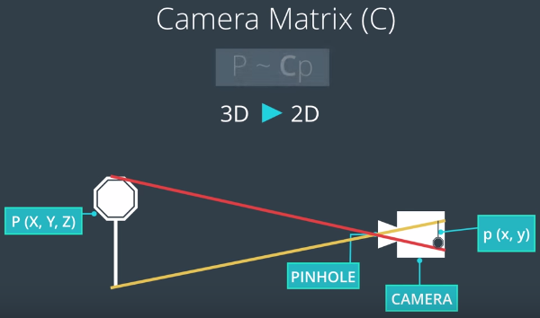
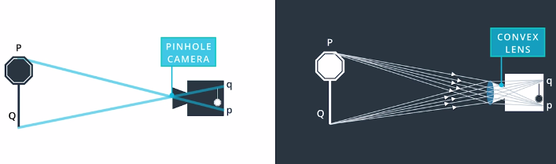
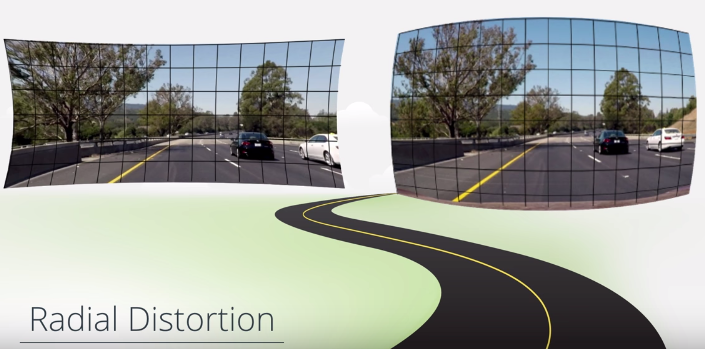
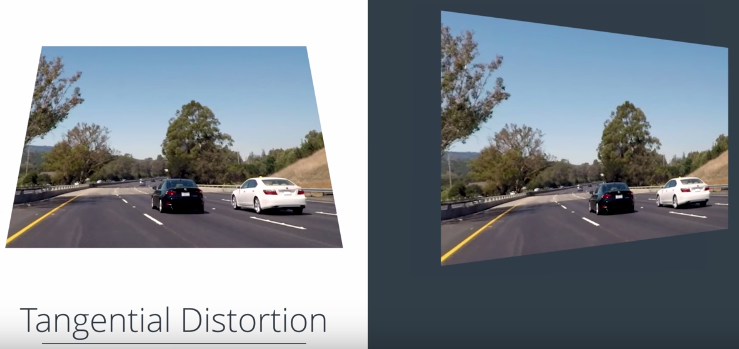
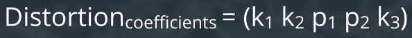
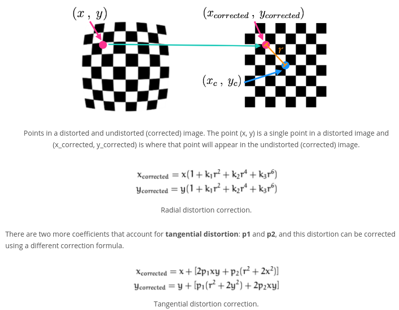

###1. Pinhole camera model
Mapping the 3D (X,Y,Z) into 2D (x,y) is done by camera matrix **C** which is used in camera calibration. Besides, real camera uses lenses to focus multiple light rays at a time. However, lenses can introduce distortion.

**Two types of distortion**
1) Light rays often bend a little too much or too little at the edges of lenses, so that lines or objects appear more or less curved than they actually are. This is called radial distortion, and it’s the most common type of distortion. 
2) Another type of distortion, is tangential distortion. This occurs when a camera’s lens is not aligned perfectly parallel to the imaging plane, where the camera film or sensor is. This makes an image look tilted so that some objects appear farther away or closer than they actually are.
<p align="center">
   
     
</p>

For common distortions, we can use five coefficients to reflect the amount of radial distortion (k1, k2, k3) and tangential distortion (p1, p2). For some severely distorted cases, sometimes even more than five coefficients are needed.
<p align="center">
   
</p>

*Note*: The distortion coefficient **k3** is required to accurately reflect major radial distortion (like in wide angle lenses). However, for minor radial distortion, which most regular camera lenses have, k3 has a value close to or equal to zero and is negligible. So, in OpenCV, you can choose to ignore this coefficient; this is why it appears at the end of the distortion values array: [k1, k2, p1, p2, k3].
<p align="center">
   
</p>

###2. Distortion correction using OpenCV step by step
1) **Finding corners**
We will use OpenCV functions findChessboardCorners() and drawChessboardCorners()

Finding chessboard corners (for an 8x6 board):
```python
gray = cv2.cvtColor(img,cv2.COLOR_BGR2GRAY)
ret, corners = cv2.findChessboardCorners(gray, (8,6), None)
```

Drawing detected corners on an image:
```python
img = cv2.drawChessboardCorners(img, (8,6), corners, ret)
```
<p align="center">
   
</p>

Then, we get the corners on the 2D images. We add the corners of each image into the variable **imgpoints**.

2) **Camera calibration**
Object points in real 3D is known, from (0,0,0) to (7,5,0). The z is 0 for each point, since the board is on a flat image plane. We add object points of each image into the variable **objpoints**.
<p align="center">
   
</p>

Camera calibration, given object points, image points, and the shape of the grayscale image:
```python
ret, mtx, dist, rvecs, tvecs = cv2.calibrateCamera(objpoints, imgpoints, gray.shape[::-1], None, None)
```
Then, we get camera matrix **mtx**, distortion coefficients **dist** used for the following undistortion. We also can get the position of the camera in the world with values of rotation vectors **rvecs** and translation vectors **tvecs**.

3) **Undistorting a test image**
```python
dst = cv2.undistort(img, mtx, dist, None, mtx)
```