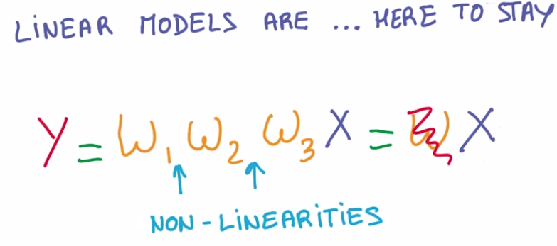
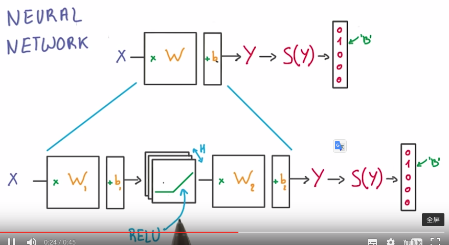
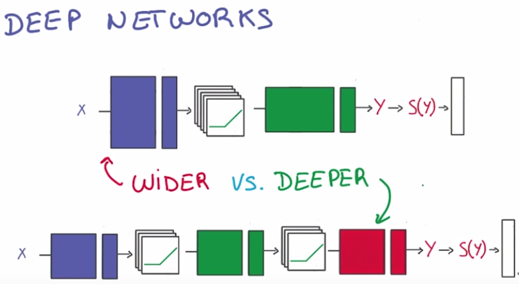
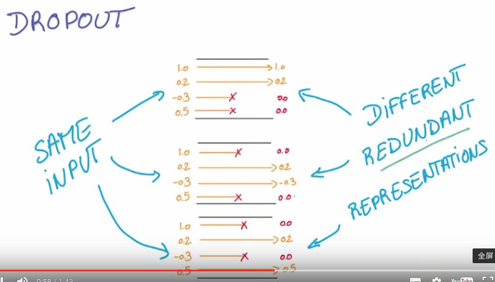
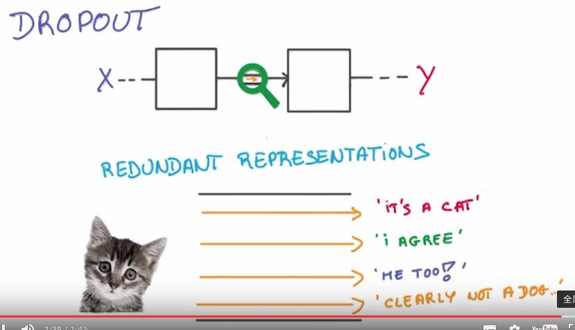
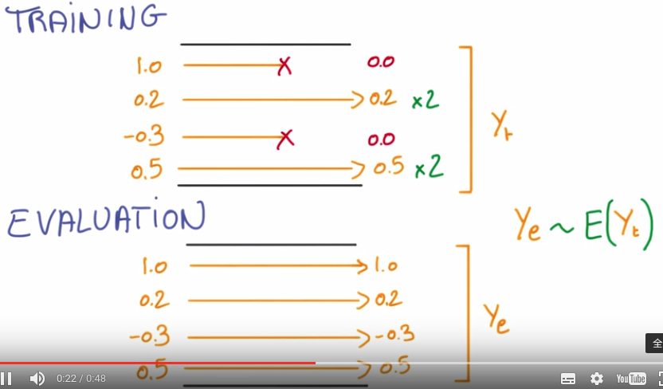

###1. Linear model's advantages & liminations
**Advantages**
1) Efficient computation, expecially using GPUs.
2) Stability: a) small changes of inputs result in small changes of outputs; b) for `y=wx+b`, `dy/dx=w` and 'dy/dx=w', both of which are constant (nothing can be more stable than constant).
**Liminations**
Linear model can only represente linear relationships which is too simple for many problems. So we need to introduce non-linearities between linear matrix multiplication.

  

###2. Non-linearity
A simple but efficient way to introduce non-linearity is insert ReLU units into our pipeline as a layer. ReLU is simple to compute and has simple gradient. 

  

BTW, the first layer effectively consists of the set of weights and biases applied to X and passed through ReLUs. The output of this layer is fed to the next one, but is not observable outside the network, hence it is known as a hidden layer.

###3. Why deeper?
1) We can typically get much more performance with fewer parameters by going deeper rather than wider.
2) Deep model can capture hierarchical structure of objects, i.e. low layers capture simple lines or edges, middle layers capture parts or shapes, high layers capture objects.

  

###4. Avoid the overfitting
1) Early stopping
2) Regularization term, such as L2-norm
3) Dropout

###5. Understanding and tricks about dropout
Dropout is to drop some percent (e.g. 50%) of the input activations during training. 

  

This can help the network to learn redundant representations, which can also be treated as ensamble of different networks.

  

Note that, in order to get the same expectation of outgoing activation, when we drop some incoming activations during training we need to scale the rest. And in the testing stage, the drop and scaling are removed. 

  

