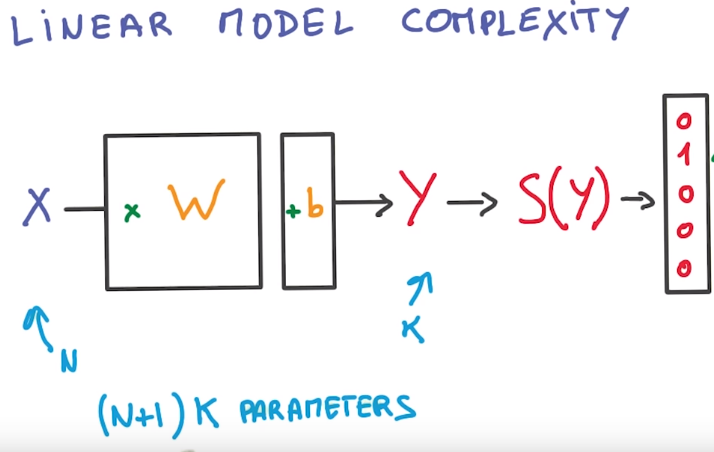
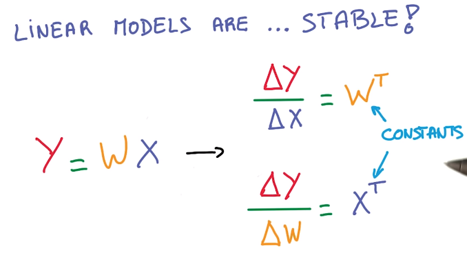
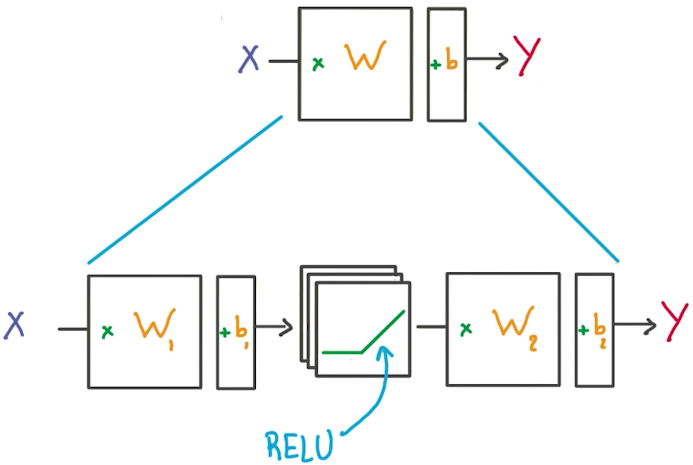

###1. Linear Model (Function Approximate)
The parameters of linear model Y=WX+b include W and b. The number of parameters are calculated as follows,

  

Linear model is efficient to compute using GPU. And the derivates w.r.t the X and W are constant, thus very stable.

  

However, linear model cannot model non-linear relations in data, such as Y=X1*X2. Therefore, we want to construct non-linear model. The simplest way is to introduce an non-linear activative function as follows,

  

