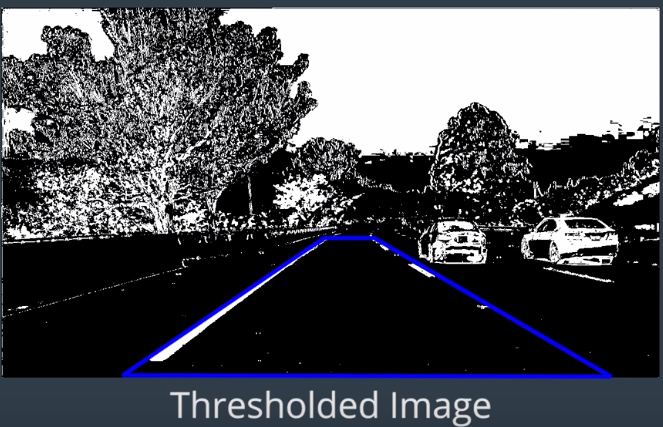
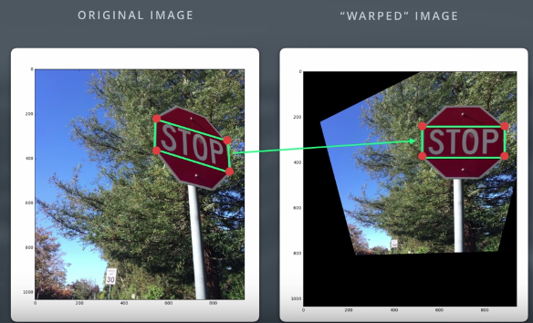
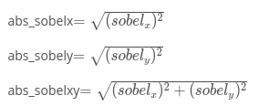
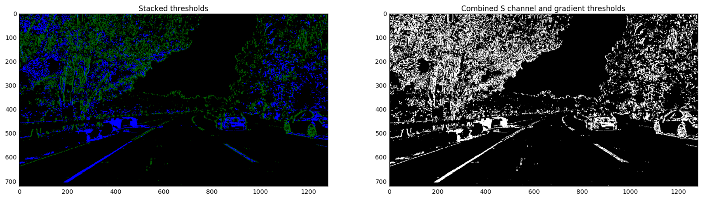

###1. Calculating Lane Curvature
You can calculate the correct steering angle for the self-driving car, if you know a few things about the speed and dynamics of the car and how much the lane is curving.

We calculate the lane curvature with several steps:
1) Detect the lane lines using some masking and thresholds.
<p align="center">
   
</p>

2) Perform perspective transform to get a birds eye view of the lane.

3) Fit a 2nd degree polynomial to that line. For a lane line that is close to vertical, you can fit a line using this formula: **f(y) = Ay^2 + By + C**, where A gives you the curvature of the lane line, B gives you the heading or direction that the line is pointing, and C gives you the position of the line based on how far away it is from the very left of an image (y = 0).

###2. Perspective transform
Perspective transform can be performed correctly on images with text or distinct reference points. On both original and "warped" images, we first select four points which are enough to define a linear transformation from one perspective to another. 
<p align="center">
   
</p>

Compute the perspective transform **M**, given source and destination points.
```python
M = cv2.getPerspectiveTransform(src, dst)
```

Compute the inverse perspective transform:
```python
Minv = cv2.getPerspectiveTransform(dst, src)
```

Warp an image using the perspective transform, M:
```python
warped = cv2.warpPerspective(img, M, img_size, flags=cv2.INTER_LINEAR)
```

*Note*: When you apply a perspective transform, choosing four source points manually, as we did in this video, is often not the best option. There are many other ways to select source points. For example, many perspective transform algorithms will programmatically detect four source points in an image based on edge or corner detection and analyzing attributes like color and surrounding pixels.

Undistort and Transform quiz:
```python
# Define a function that takes an image, number of x and y points, 
# camera matrix and distortion coefficients
def corners_unwarp(img, nx, ny, mtx, dist):
    # Use the OpenCV undistort() function to remove distortion
    undist = cv2.undistort(img, mtx, dist, None, mtx)
    # Convert undistorted image to grayscale
    gray = cv2.cvtColor(undist, cv2.COLOR_BGR2GRAY)
    # Search for corners in the grayscaled image
    ret, corners = cv2.findChessboardCorners(gray, (nx, ny), None)

    if ret == True:
        # If we found corners, draw them! (just for fun)
        cv2.drawChessboardCorners(undist, (nx, ny), corners, ret)
        # Choose offset from image corners to plot detected corners
        # This should be chosen to present the result at the proper aspect ratio
        # My choice of 100 pixels is not exact, but close enough for our purpose here
        offset = 100 # offset for dst points
        # Grab the image shape
        img_size = (gray.shape[1], gray.shape[0])

        # For source points I'm grabbing the outer four detected corners
        src = np.float32([corners[0], corners[nx-1], corners[-1], corners[-nx]])
        # For destination points, I'm arbitrarily choosing some points to be
        # a nice fit for displaying our warped result 
        # again, not exact, but close enough for our purposes
        dst = np.float32([[offset, offset], [img_size[0]-offset, offset], 
                                     [img_size[0]-offset, img_size[1]-offset], 
                                     [offset, img_size[1]-offset]])
        # Given src and dst points, calculate the perspective transform matrix
        M = cv2.getPerspectiveTransform(src, dst)
        # Warp the image using OpenCV warpPerspective()
        warped = cv2.warpPerspective(undist, M, img_size)

    # Return the resulting image and matrix
    return warped, M
```

###3. Gradient
The Sobel operator is at the heart of the Canny edge detection algorithm. Applying the Sobel operator to an image is a way of taking the derivative of the image in the x or y direction. The operators for Sobel_x​​ and Sobel_y, respectively, look like this:
<p align="center">
  
</p>

Applying Sobel:
```python
# Define a function that applies Sobel x or y, 
# then takes an absolute value and applies a threshold.
# Note: calling your function with orient='x', thresh_min=5, thresh_max=100
# should produce output like the example image shown above this quiz.
def abs_sobel_thresh(img, orient='x', thresh_min=0, thresh_max=255):
    
    # Apply the following steps to img
    # 1) Convert to grayscale
    # 2) Take the derivative in x or y given orient = 'x' or 'y'
    # 3) Take the absolute value of the derivative or gradient
    # 4) Scale to 8-bit (0 - 255) then convert to type = np.uint8
    # 5) Create a mask of 1's where the scaled gradient magnitude 
            # is > thresh_min and < thresh_max
    # 6) Return this mask as your binary_output image
    gray = cv2.cvtColor(img, cv2.COLOR_RGB2GRAY)
    if 'x'==orient:
        sobel = cv2.Sobel(gray, cv2.CV_64F, 1, 0)
    elif 'y'==orient:
        sobel = cv2.Sobel(gray, cv2.CV_64F, 0, 1)
    abs_sobel = np.absolute(sobel)
    scaled_sobel = np.uint8(255*abs_sobel/np.max(abs_sobel))
    binary_output = np.zeros_like(scaled_sobel)
    binary_output[(scaled_sobel >= thresh_min) & (scaled_sobel <= thresh_max)] = 1
    return binary_output
```

It's also worth considering the size of the region (i.e. kernel size) in the image over which you'll be taking the gradient. Taking the gradient over larger regions can smooth over noisy intensity fluctuations on small scales. The default Sobel kernel size is 3, and it must be an odd number.

The magnitude of the gradient is just the square root of the squares of the individual x and y gradients. For a gradient in both the x and y directions, the magnitude is the square root of the sum of the squares.
<p align="center">
  
</p>

The direction of the gradient is simply the inverse tangent (arctangent) of the y gradient divided by the x gradient:

```arctan(sobel_​y/sobel_​x).```

###4. Color Space
The H and S channels in HLS color space stay fairly consistent under shadow or excessive brightness, compared to RGB.

###5. Color and Gradient Threshold
The output is shown below. The final image color_binary is a combination of binary thresholding the S channel (HLS) and binary thresholding the result of applying the Sobel operator in the x direction on the original image.
<p align="center">
  
</p>