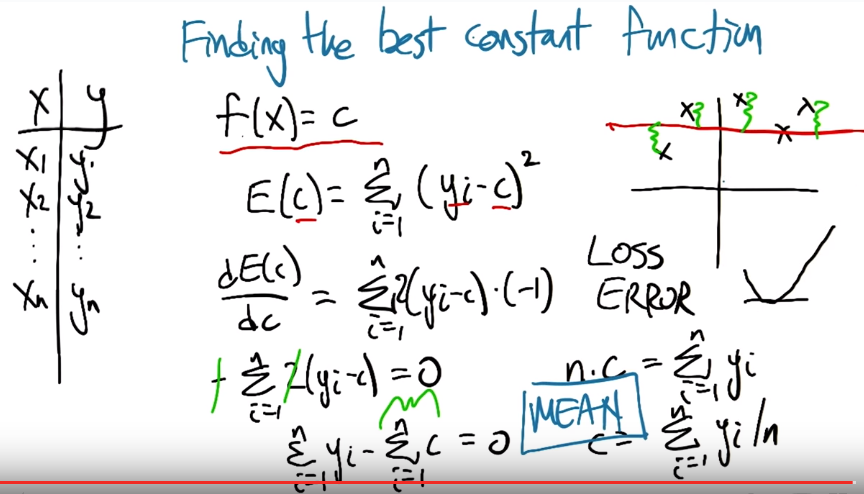
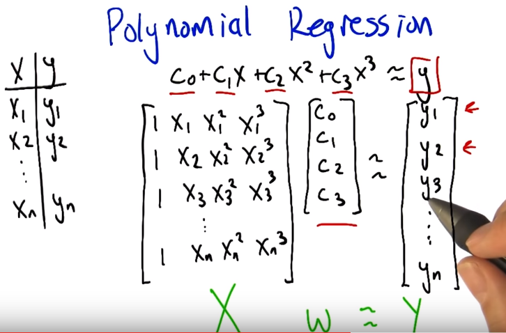
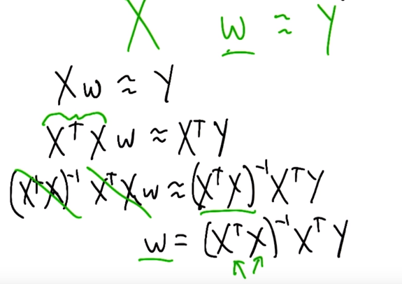

###1. Dfferences between Regression and Classification
**Regression**: the output is continuous, such as real-value.
**Classification**: the output is discreate, such as binary True/False, multiple category.
For example, *Human Age Estimation* can be treated as regression problem if fraction is allowed, i.e. unlimited categories. While, it can also be treated as classification problem if there are only limited categories, like 1,2,3,...,150.

###2. Regression (Function Approximate)
There are many estimation methods to solve a regression problem. see [Linear regression from wikipedia](https://en.wikipedia.org/wiki/Linear_regression). Before inducing these methods, we should need to know [What Is the Difference between  Linear and Nonlinear Equations in Regression Analysis?](http://blog.minitab.com/blog/adventures-in-statistics/what-is-the-difference-between-linear-and-nonlinear-equations-in-regression-analysis) and [What is regressor?](http://courses.umass.edu/pubp608/lectures/l8.pdf). Simply, a regressor is a variable `X` which may have multiple dimensions, and the linear model is the linear combination of these regressor, even its square, cube, log or other forms. Such as `Y = b0 + b1X + b2X^2`

  

When use square function as the fit error in regression, we can use **calculus** (In nature, it is just the same with the following *OLS*). The minimum of the sum of squares is found by setting the gradient to zero. (cf. https://en.wikipedia.org/wiki/Least_squares). Besides, note that if there are `N` samples in data, then the highest order should be no more then `N-1` (start from `0`). 
P.S. the example in the course show that the best constant in terms of squared error is **mean**, i.e. for zeor order regression `y=c` then `y_best=c/N`.

  

  

*Ordinary least squares (OLS)* is the simplest and thus most common estimator. The OLS method minimizes the **sum of squared residuals**, and leads to a **closed-form** expression (just the same with the above **cauculus** with square error). When refer to fit linear function `X*W=Y`, we can use `X'X*W=X'*Y` --> `W=(X'X)\(X'*Y)`. It is because that `X` may not be square matrix and may not have good inverse, while `X'X` is square matrix and always have good inverse for simple problem. In simple linear regression, where there is only one regressor (with a constant), the OLS coefficient estimates have a simple form.If the goal is either inference or predictive modeling, the performance of OLS estimates can be poor if multicollinearity is present, unless the sample size is large. But it's hard for storage and computation accuracy if the sample size is too large.

*Gradient descent* methods such as Newton-type method is usually a good way to solve **Least Square Problem** iterativelly and efficiently.

A nice disscusion about these methods can be seen [Solving for regression parameters in closed-form vs gradient descent](http://stats.stackexchange.com/questions/23128/solving-for-regression-parameters-in-closed-form-vs-gradient-descent)

###3. Error & Cross Validation 
Where does the Error come from ?

1) sensor error

2) maliciously - being given bad data

3) transcription error, such as mistyping

4) unmodeled influences

So, we need to use **Cross Validation** to choose the model (among different structures and hyperparameters).
Note: The goal of Machine Learning is "Generalization". The training data and test data are all sampled from the same distribution but they are i.i.d.

###4. Representation for regression
The input can be scalar/vector, discrete/continuous, numerical/enumerated. Such as hair color can be blue, red, green, black .... A good representation for hair color is RGB value, which makes more sense.
