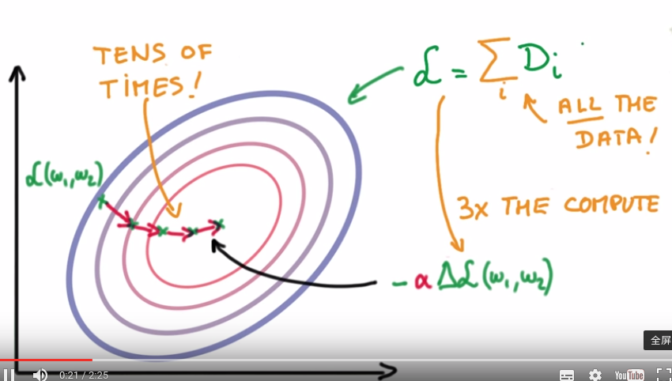

###1. Normalize the inputs
Why do we need to normalize the inputs?
1) Calculation with large and small figures together may result in large numeric errors. 
2) To make the problem well conditioned. When the inputs is zero-mean and small equal-variance, it can be easy for weights initilization and loss convergence.

  

###2. Initialize the inputs
Since we have normalized the inputs to zero-mean, we can sample the initial weights with standard Gaussian distribution. Note that, large sigma in Gaussian means the distrbution has large peaks which is very opinionated. While small sigma in Gaussian means the distrbution is very uncertain, thus it is more suitable for initialization.

  

###3. Rule of thumb for validation set size
Typically, in Statistics, the model parameters become better if more than 30 examples are corrected from FP to TP. So, in make accuracy figures significant to the first decimal place (i.e. 0.1% valid figure), we usually need more than 30000 examples for validation. In practice, we may not have some many data, and we can use cross-validation to mitigate this problem.

  

###4. Gradient Descent (GD) vs Stochastic Gradient Descent (SGD)
When dealing with large scale data， the compute for GD is expensive, usually 3 times more (why?). We can get estimate of the gradient descent of all data, just choose subset randomly and use their gradient descent. This estimation may be bad, so we need enough randomness and more iterations. While SGD is very fast and simple, so it performs well in practice. In the following figures, the top is GD, and the bottom is SGD. 

  

  

Something we should keep in mind:

  

###5. Improvement for SGD
1) Momenton, which uses the past accumulated knowledge to help the gradient descent.

  

2) Learning rate decay

  

